<p align="center">
  <a href="https://github.com/melch-inno/wiredC/actions"></a>
</p>

# Node Api using TypeScript || WiredCraft test assignment

- This demonstrate a simple crud operation
- I used sessions and refresh tokens authentication
-

## dependencies

```bash
yarn add express yup config cors express mongoose pino pino-pretty dayjs bcrypt jsonwebtoken lodash nanoid
```

## dev-dependencies

```bash
yarn add @types/body-parser @types/config @types/cors @types/express @types/node @types/yup @types/pino @types/mongoose @types/bcrypt @types/jsonwebtoken @types/lodash @types/nanoid ts-node typescript -D
```

## Install the dependencies

```bash
$ yarn
  or
$ npm install
```

How to configure App:
1. After installing the dependencies,
2. run yarn dev
3. Use postman to test the api
4. The project has "WiredCraft.postman_collection.json" file in the root folder
5. It can be imported into postman for quick setting

Build the typescript and package it for distribution

```bash
$ npm run build && npm run package
```

Run the tests :heavy_check_mark:

```bash
$ npm test

 PASS  ./index.test.js
  ✓ throws invalid number (3ms)
  ✓ wait 500 ms (504ms)
  ✓ test runs (95ms)

...
```

## Validate

You can now validate the action by referencing `./` in a workflow in your repo (see [test.yml](.github/workflows/test.yml))

```yaml
uses: ./
with:
  milliseconds: 1000
```

## Perform all testing: use `yarn all` to run below test in the app

```bash
"npm run build && npm run format && npm run lint && npm run package && npm test"
```

## Testing lint:

to reference the stable and latest V1 action

```bash
npm run lint
```

## using the app

1. signup using the signup paramenters
2. create a session / signin 3. update user
3. delete user [ user isDeleted is set to true]
4. create/update/delete posts
5. follow and unfollow users
6. delete session [signout/logout]
7. Oauth signup with github account

## Screenshots of the various testing stages

## Create User

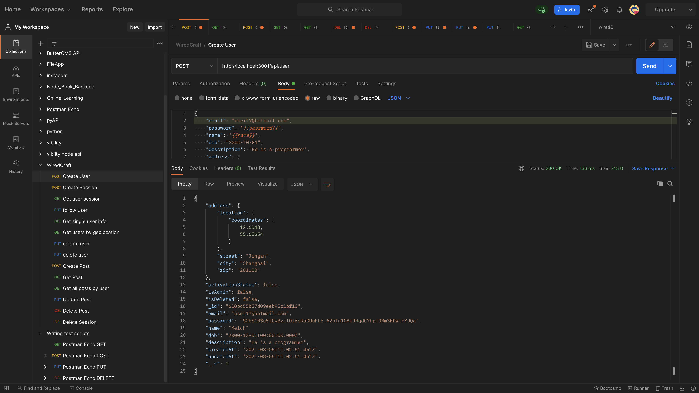

## Login (create a session)

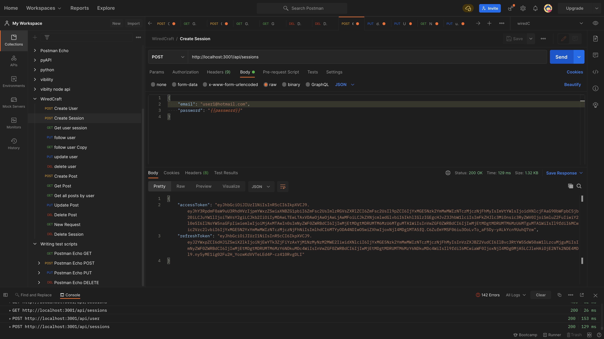


## get a user and set userId

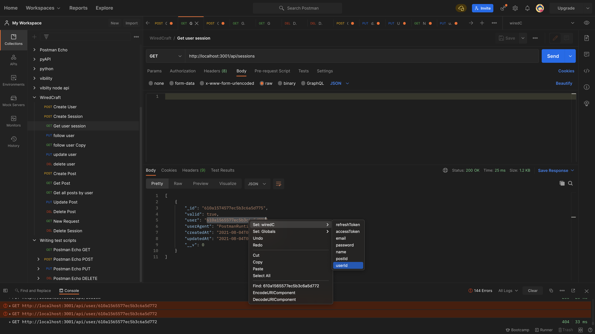

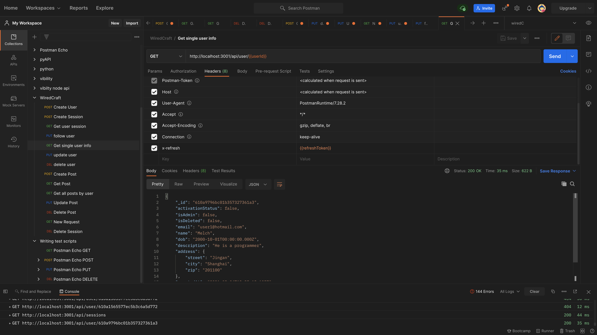

## Follow and unfollow

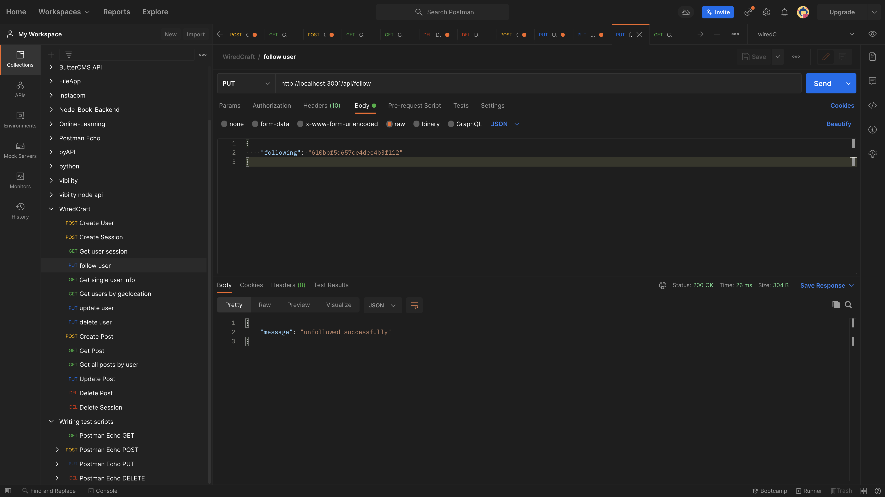

## Update a user

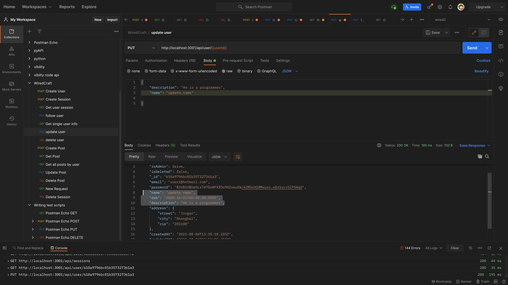

## delete a user

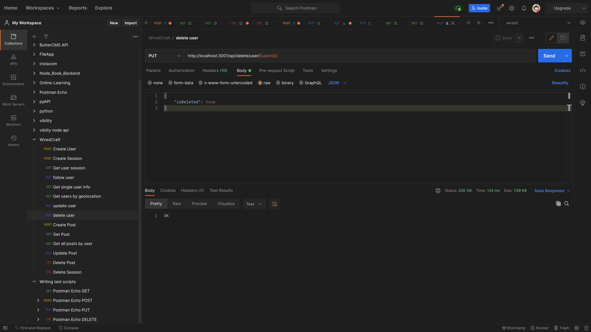

## create a post

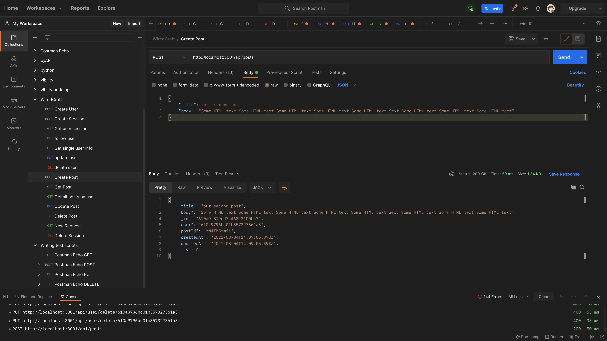

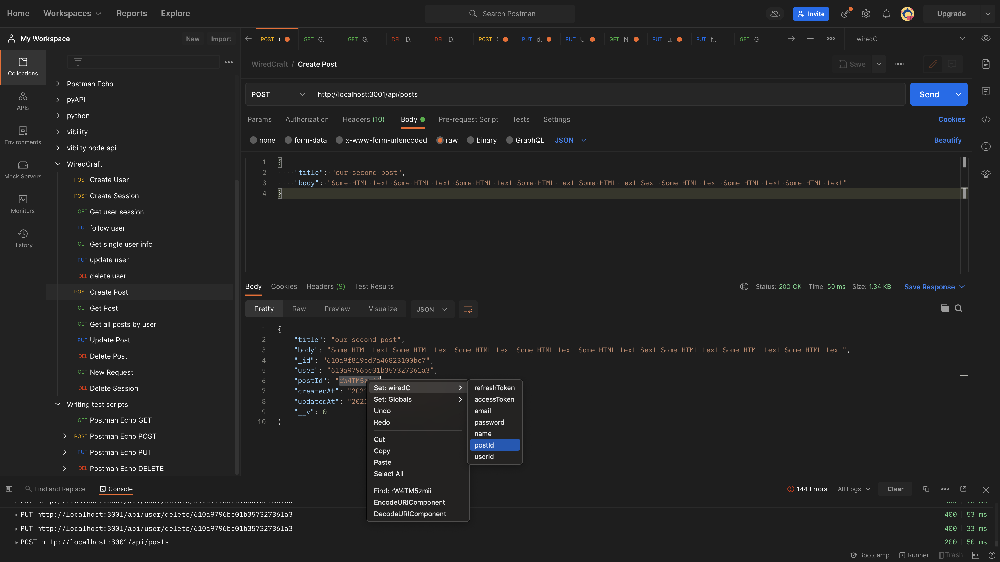

## Get a post

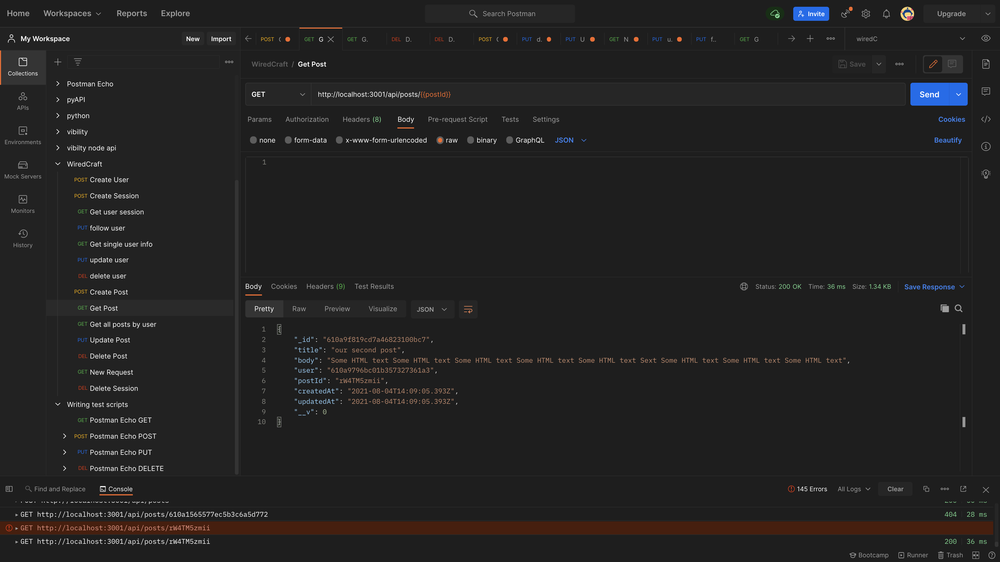

## get all posts by a user

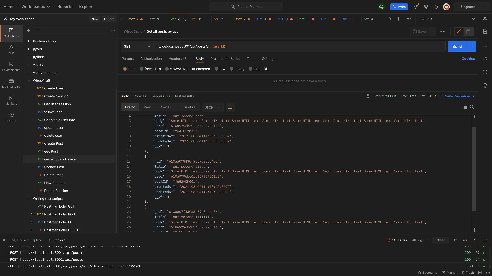

## update a post

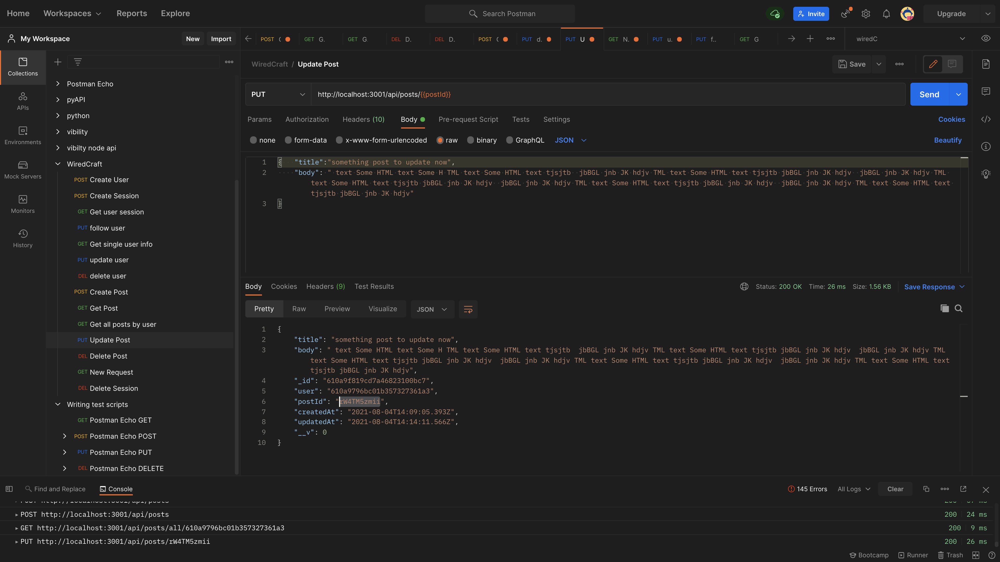

## delete a post

```yml
http://localhost:3001/api/posts/{{postId}}
```

## Run react frontend to test

```bash
1. cd static
2. yarn
3. run `yarn start`
```

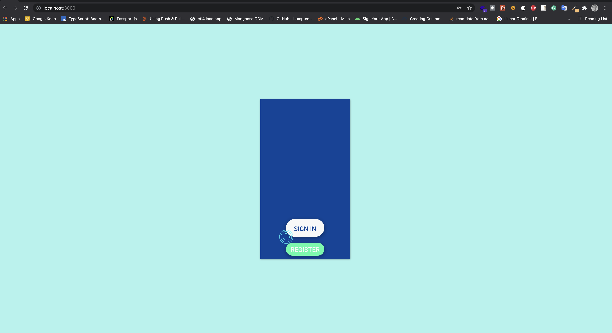
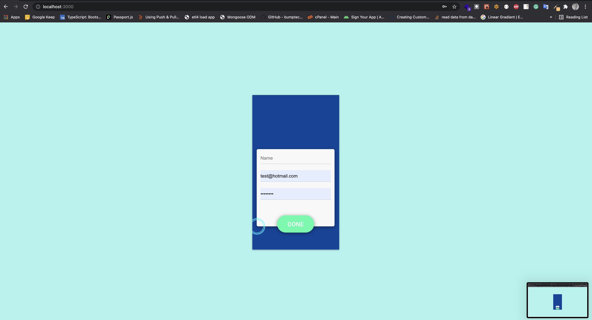
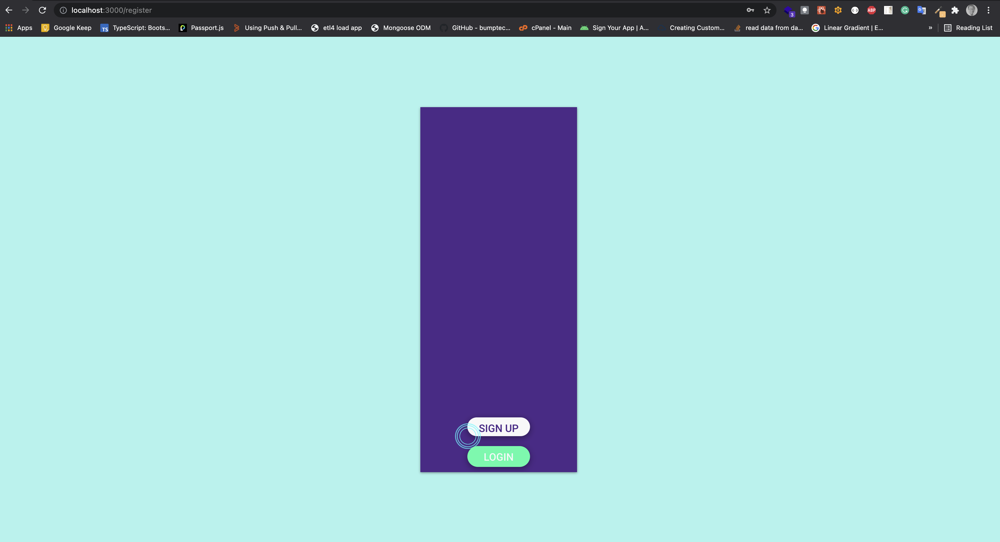
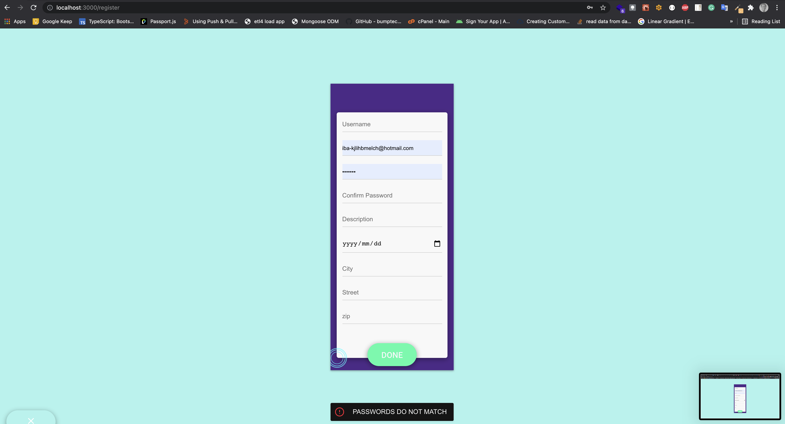

## get user detail

```yaml
await axios({
    method: "get",
    url: `http://localhost:3001/api/user/${userId}`,
    headers: {
        "Authorization": `Bearer ${tokens.accessToken}`,
        'x-refresh': tokens.refreshToken,
        'Accept': '*/*',
        'Access-Control-Allow-Methods': 'GET',
        'Content-Type': 'application/json',
    }
})
```

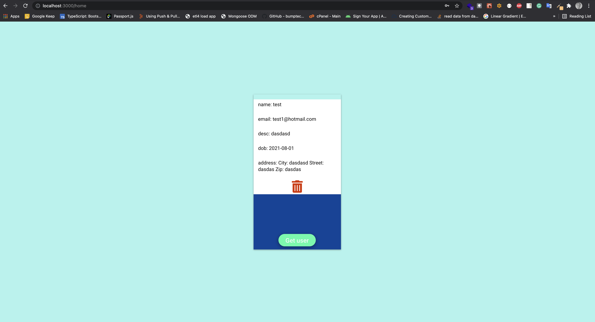

```

```
